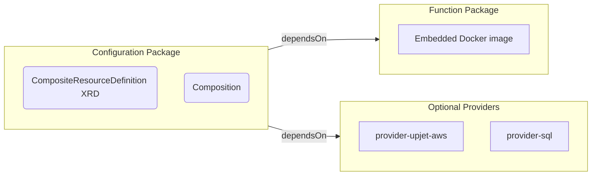

**This repository has moved to the Crossplane org at <https://github.com/crossplane/function-template-typescript> and will be archived.**

# Crossplane Function Template - TypeScript <!-- omit in toc -->


This repository is a template for building Crossplane composition functions in TypeScript using the [@crossplane-org/function-sdk-typescript](https://github.com/crossplane/function-sdk-typescript).

- [Overview](#overview)
- [Quick Start](#quick-start)
- [Running the Example Package](#running-the-example-package)
- [Installing the Package](#installing-the-package)
  - [Deploy the Example Manifest](#deploy-the-example-manifest)
  - [Validate the Example is running](#validate-the-example-is-running)
- [Development Prerequisites](#development-prerequisites)
- [Project Structure](#project-structure)
- [Installation](#installation)
- [Development](#development)
  - [Build TypeScript](#build-typescript)
  - [Type Checking](#type-checking)
  - [Testing](#testing)
  - [Linting and Formatting](#linting-and-formatting)
  - [Running Locally](#running-locally)
  - [Available CLI Options](#available-cli-options)
- [Building and Packaging](#building-and-packaging)
  - [Local Docker Build](#local-docker-build)
  - [Build the Crossplane Function Package](#build-the-crossplane-function-package)
    - [Update the Function Package Metadata](#update-the-function-package-metadata)
    - [Building the Function Package](#building-the-function-package)
  - [Configuration Package](#configuration-package)
    - [Updating the `crossplane.yaml` File](#updating-the-crossplaneyaml-file)
    - [Build the Configuration Package](#build-the-configuration-package)
- [Implementation Guide](#implementation-guide)
  - [Creating Your Function](#creating-your-function)
  - [Key SDK Functions](#key-sdk-functions)
  - [Example: Creating a Resource](#example-creating-a-resource)
  - [Using Kubernetes Models](#using-kubernetes-models)
  - [Testing Your Function](#testing-your-function)
- [TypeScript Configuration](#typescript-configuration)
- [GitHub Actions](#github-actions)
  - [CI Workflow (ci.yaml)](#ci-workflow-ciyaml)
  - [Tag Workflow (tag.yml)](#tag-workflow-tagyml)
- [Dependencies](#dependencies)
  - [Production Dependencies](#production-dependencies)
  - [Dev Dependencies](#dev-dependencies)
- [Notes](#notes)
- [Troubleshooting](#troubleshooting)
  - [TypeScript Compilation Errors](#typescript-compilation-errors)
  - [Test Failures](#test-failures)
  - [Docker Build Failures](#docker-build-failures)
- [License](#license)
- [Author](#author)

## Overview

This template provides a full Typescript project for developing Crossplane functions that can transform, validate, and generate Kubernetes resources within Crossplane compositions.

The initial [src/function.ts](src/function.ts) creates sample Deployment, Ingress, Service, and ServiceAccount resources and can be customized to
create any type of Kubernetes resource.

For an example of configuring cloud resources, refer to [configuration-aws-network-ts](https://github.com/upbound/configuration-aws-network-ts).

## Quick Start

1. Clone this repository
2. Update [package.json](package.json) for your Project.
3. Update the code at [src/function.ts](src/function.ts)
4. Create your API (`CompositeResourceDefinition`) like the one for `App` in [package-configuration/apis/apps/definition.yaml](package-configuration/apis/apps/definition.yaml)
5. Create an example in the `examples` directory like [examples/apps/example.yaml](examples/apps/example.yaml)
6. Build, locally-run and `crossplane render` your Composition. See the [Development](#development) section.

## Running the Example Package

The configuration and function are published to the [Upbound Marketplace](https://marketplace.upbound.io),
and can be installed into a Crossplane environment.

## Installing the Package

The Configuration package will install the function package, which contains a
Node docker image and the source code as a dependency.

```yaml
apiVersion: pkg.crossplane.io/v1
kind: Configuration
metadata:
  name: configuration-template-typescript
spec:
  package: xpkg.upbound.io/crossplane/function-template-typescript:v0.1.0
```

Once installed, confirm that the package and dependencies are installed:

```shell
crossplane beta trace con
figuration.pkg configuration-template-typescript
NAME                                                                              VERSION          INSTALLED   HEALTHY   STATE    STATUS
Configuration/configuration-template-typescript                                   v0.1.0   True        True      -        HealthyPackageRevision
├─ ConfigurationRevision/configuration-template-typescript-93b73b00eb21           v0.1.0   -           -         Active
├─ Function/crossplane-contrib-function-auto-ready                                v0.6.0           True        True      -        HealthyPackageRevision
│  └─ FunctionRevision/crossplane-contrib-function-auto-ready-59868730b9a9        v0.6.0           -           -         Active
└─ Function/crossplane-function-template-typescript-function                           v0.1.0   True        True      -        HealthyPackageRevision
   └─ FunctionRevision/crossplane-function-template-typescript-function-cd83fe939bc7   v0.1.0   -
```

### Deploy the Example Manifest

Once the package is installed and healthy, create the
target namespace and install the example:

```shell
$ kubectl apply -f examples/app/ns.yaml
namespace/example created

$ kubectl apply -f examples/apps/example.yaml
app.platform.upbound.io/hello-app created
```

### Validate the Example is running

Use `crossplane beta trace` to validate the Composition:

```shell
crossplane beta trace -n example app.platform.upbound.io/hello-app
NAME                                             SYNCED   READY   STATUS
App/hello-app (example)                          True     True    Available
├─ Deployment/hello-app-7ff730da5be9 (example)   -        -
├─ ServiceAccount/my-service-account (example)   -        -
└─ Service/hello-app-ab25df85445e (example)      -        -
```

Next, examine the resources in the namespace:

```shell
kubectl get all,sa -n example -l app.kubernetes.io/instance=hello-app
NAME                                          READY   STATUS    RESTARTS   AGE
pod/hello-app-7ff730da5be9-76975c8c4c-mth2n   1/1     Running   0          5m36s

NAME                             TYPE        CLUSTER-IP      EXTERNAL-IP   PORT(S)    AGE
service/hello-app-ab25df85445e   ClusterIP   10.96.153.148   <none>        8080/TCP   5m36s

NAME                                     READY   UP-TO-DATE   AVAILABLE   AGE
deployment.apps/hello-app-7ff730da5be9   1/1     1            1           5m36s

NAME                                                DESIRED   CURRENT   READY   AGE
replicaset.apps/hello-app-7ff730da5be9-76975c8c4c   1         1         1       5m36s

NAME                                SECRETS   AGE
serviceaccount/my-service-account   0         5m36s
```

Change the settings in [`examples/apps/example.yaml`](examples/apps/example.yaml) and observe the generated resources.

## Development Prerequisites

To develop Compositions using Typescript, the following is recommended:

- Node.js 24 or later recommended.
- npm
- Docker (for building the Node container image)
- Both TypeScript 5+ and TypeScript 7 (tsgo) are supported.

## Project Structure

```text
.
├── src/                          # Source files
│   ├── function.ts               # Main function implementation
│   ├── function.test.ts          # Function tests
│   ├── test-helpers.ts           # Test utilities for loading YAML test cases
│   └── main.ts                   # Entry point and server setup
├── test-cases/                   # YAML-based test cases
│   ├── README.md                 # Test case documentation
│   └── example.yaml              # Example test case
├── examples/                     # Example Crossplane resources
│   ├── apps/                     # Example application resources
│   └── functions.yaml            # Function pipeline configuration
├── scripts/                      # Build and deployment scripts
│   ├── function-docker-build.sh
│   ├── function-xpkg-build.sh
│   ├── function-xpkg-push.sh
│   ├── configuration-xpkg-build.sh
│   └── configuration-xpkg-push.sh
├── package-configuration/        # Configuration package metadata
│   ├── apis                      # Crossplane Composition Files
│   │   └── apps                  # Directory for the Kubernetes App Kind
│   │       ├── composition.yaml  # Crossplane Composition Pipeline Definition
│   │       └── definition.yaml   # Crossplane CompositeResourceDefinition
│   └── crossplane.yaml           # Configuration package manifest
├── package-function/             # Function package metadata
│   └── crossplane.yaml           # Function package manifest
├── dist/                         # Compiled JavaScript output (generated)
├── _build/                       # Build artifacts (generated)
├── package.json                  # Dependencies and scripts
├── tsconfig.json                 # TypeScript configuration
├── tsconfig.eslint.json          # TypeScript ESLint configuration
├── jest.config.js                # Jest test configuration
├── eslint.config.js              # ESLint configuration
├── env                           # Environment variables for build scripts
└── Dockerfile                    # Container image definition
```

## Installation

1. Clone this repository
2. Install dependencies:

```bash
npm install
```

## Development

### Build TypeScript

Compile TypeScript to JavaScript using TypeScript 5:

```bash
npm run tsc
```

TypeScript 7 (tsgo) is the default engine for the build:

```bash
npm run build
# or
npm run tsgo
```

### Type Checking

Check types without emitting files:

```bash
npm run check-types
```

### Testing

Run tests using Jest:

```bash
npm test
```

TypeScript tests are written in [src/function.test.ts](src/function.test.ts). YAML-based test cases can be created using the [test-cases/](test-cases/) directory. See [test-cases/README.md](test-cases/README.md) for more information on creating tests. Example Crossplane resources for testing are provided in the [examples/](examples/) directory.

### Linting and Formatting

The project includes ESLint and Prettier for code quality:

```bash
# Lint code
npm run lint

# Auto-fix linting issues
npm run lint:fix

# Format code with Prettier
npm run format

# Check formatting without changing files
npm run format:check
```

### Running Locally

Run the function server in insecure mode for local testing:

```bash
npm run local
# or
node dist/main.js --insecure --debug
```

Once the function is running locally, `crossplane render` can be used to render examples:

```shell
crossplane render examples/apps/example.yaml package-configuration/apis/apps/composition.yaml examples/functions.yaml
```

### Available CLI Options

- `--address` - Address to listen for gRPC connections (default: `0.0.0.0:9443`)
- `-d, --debug` - Enable debug logging
- `--insecure` - Run without mTLS credentials (for local development)
- `--tls-server-certs-dir` - Directory containing mTLS certificates (default: `/tls/server`)

## Building and Packaging

[Crossplane Packages](https://docs.crossplane.io/master/packages/) are used to deploy
the Function and and dependencies to a Crossplane environment. Each of the package types serves a distinct purpose:

- Configuration Packages contain the API (Composite Resource Definition) and Composition (Pipeline Steps). Configuration packages can pull in other packages types as dependencies.
- The Function Package contains the TypeScript files bundled in a runnable Node Docker container.
- Optional Packages that contain support for managing external APIs like GCP, AWS, and Azure.



### Local Docker Build

This template repository includes [Github Actions](#github-actions) for building and pushing the images.

Scripts are provided that can also be run via npm
to build and publish packages.

To build the docker image run:

```bash
npm run function-docker-build
```

The images will be saved as `tar` files that can be
packed into a Function Package:

```shell
tree _build/docker_images
_build/docker_images
├── function-template-typescript-function-runtime-amd64-v0.1.0.tar
└── function-template-typescript-function-runtime-arm64-v0.1.0.tar
```

The Dockerfile uses a multi-stage build:

1. **Build stage**: Uses `node:24` (LTS) to install dependencies and compile TypeScript
2. **Runtime stage**: Uses `gcr.io/distroless/nodejs24-debian12` for a minimal, secure runtime that includes the compiled TypeScript source.

Refer to the [`scripts`](./scripts/) directory for examples of multi-platform builds.

### Build the Crossplane Function Package

Now that runnable Docker images have been generated, they
can be embedded into a Function package.

#### Update the Function Package Metadata

First Update the Function Package [`crossplane.yaml`](package-function/crossplane.yaml) to the name of the Function.

Update the `metadata.name` and `metadata.annotations` in the `crossplane.yaml` file.

#### Building the Function Package

Build the function as a Crossplane package (xpkg):

```bash
# Build the function package
npm run function-xpkg-build
```

Function packages will be generated for arm64 and amd64 in
the `_build/xpkg` directory:

```shell
$ tree _build/xpkg
_build/xpkg
├── function-template-typescript-function-amd64-v0.1.0.xpkg
└── function-template-typescript-function-arm64-v0.1.0.xpkg
```

These packages can be pushed to any Docker Registry using `crossplane xpkg push`. Update the `XPKG_REPO` in the [env](env)
file to change the target repository.

```shell
# Push to a registry
npm run function-xpkg-push

# Build and push in one step
npm run function-build-all
```

### Configuration Package

With the Function package created, the Configuration
Package can be generated. This package will install the Function
Package as a dependency.

#### Updating the `crossplane.yaml` File

First Update the Configuration Package [`crossplane.yaml`](package-configuration/crossplane.yaml) to the name of the Configuration.

Update the `metadata.name` and `metadata.annotations` in the `crossplane.yaml` file.

Next update the `spec.dependsOn` field to include the function Docker image and any other dependencies, like [function-auto-ready](https://github.com/crossplane-contrib/function-auto-ready).

```yaml
spec:
  dependsOn:
    - apiVersion: pkg.crossplane.io/v1
      kind: Function
      package: xpkg.upbound.io/crossplane-contrib/function-auto-ready
      version: '>=v0.6.0'
    # Make this match your function
    - apiVersion: pkg.crossplane.io/v1
      kind: Function
      package: xpkg.upbound.io/crossplane/function-template-typescript-function
      version: '>=v0.1.0'
```

A Crossplane Composition requires a `CompositeResourceDefinition` (XRD) and `Composite`. These
are located in the [package-configuration/apis](package-configuration/apis) directory.

Since the Kind in the template function is an `App`, we create a subdirectory `apps`.

- [package-configuration/apis/apps/definition.yaml](package-configuration/apis/apps/definition.yaml) contains the XRD definition.
- [package-configuration/apis/apps/composition.yaml](package-configuration/apis/apps/composition.yaml) contains the Composition pipeline.

Update the `composition.yaml` file to have the functionRef of the first pipeline step to refer to the name
of the function once it is installed. Crossplane creates a function name of `<docker repository>-<function-name>`,
so `xpkg.upbound.io/crossplane/function-template-typescript-function` would have a `functionRef.name` of
`crossplane-function-template-typescript-function`.

Update the value with the name that represents the Docker registry and image where the function was pushed.

```yaml
- functionRef:
    name: crossplane-function-template-typescript-function
  step: app
```

#### Build the Configuration Package

Build the Crossplane configuration package:

```bash
# Build configuration package
npm run configuration-xpkg-build
```

The `_build/xpkg` directory will contain the multi-platform function
images and the Configuration package image:

```shell
tree _build/xpkg
_build/xpkg
├── function-template-typescript-function-amd64-v0.1.0.xpkg
├── function-template-typescript-function-arm64-v0.1.0.xpkg
└── function-template-typescript-v0.1.0.xpkg
```

Push this package to a Docker registry:

```shell
# Push configuration package
npm run configuration-xpkg-push
```

Local build scripts are located in the [scripts/](scripts/) directory and can be customized. Common settings are contained
in the [`env`](env) file.

## Implementation Guide

### Creating Your Function

Edit [src/function.ts](src/function.ts) to implement your function logic. The main interface is:

```typescript
export class Function implements FunctionHandler {
  async RunFunction(req: RunFunctionRequest, logger?: Logger): Promise<RunFunctionResponse> {
    // Your function logic here
  }
}
```

### Key SDK Functions

The SDK provides helper functions for working with Crossplane resources:

- `getObservedCompositeResource(req)` - Get the observed composite resource (XR)
- `getDesiredCompositeResource(req)` - Get the desired composite resource
- `getObservedComposedResources(req)` - Get observed composed resources
- `getDesiredComposedResources(req)` - Get desired composed resources
- `setDesiredComposedResources(rsp, resources)` - Set desired composed resources
- `Resource.fromJSON()` - Create resources from JSON
- `normal(rsp, message)` - Add a normal condition to the response
- `fatal(rsp, message)` - Add a fatal condition to the response
- `to(req)` - Create a minimal response from a request

See [src/function.ts](src/function.ts) for examples of using these SDK functions.

### Example: Creating a Resource

```typescript
import { Resource } from '@crossplane-org/function-sdk-typescript';

// Create from JSON
const resource = Resource.fromJSON({
  resource: {
    apiVersion: 'v1',
    kind: 'ConfigMap',
    metadata: {
      name: 'my-config',
      namespace: 'default',
    },
    data: {
      key: 'value',
    },
  },
});

// Add to desired composed resources
desiredComposed['my-config'] = resource;
```

### Using Kubernetes Models

The template includes [kubernetes-models](https://github.com/tommy351/kubernetes-models-ts) for type-safe K8s resource creation:

```typescript
import { Pod } from 'kubernetes-models/v1';

const pod = new Pod({
  metadata: {
    name: 'my-pod',
    namespace: 'default',
  },
  spec: {
    containers: [
      {
        name: 'app',
        image: 'nginx:latest',
      },
    ],
  },
});

pod.validate(); // Validate the resource

desiredComposed['my-pod'] = Resource.fromJSON({ resource: pod.toJSON() });
```

### Testing Your Function

Create YAML test cases in the [test-cases/](test-cases/) directory. Each test case defines:

- Input: The observed composite resource and context
- Expected: Resource counts, types, and validation rules

See [test-cases/example.yaml](test-cases/example.yaml) for an example. Tests use [src/test-helpers.ts](src/test-helpers.ts) to load and validate YAML test cases.

## TypeScript Configuration

This template uses strict TypeScript settings:

- `strict: true` - All strict type checking options
- `noUncheckedIndexedAccess: true` - Safer array/object access
- `exactOptionalPropertyTypes: true` - Stricter optional properties
- `verbatimModuleSyntax: true` - Explicit import/export syntax

The SDK directory is excluded from compilation to avoid conflicts with different TypeScript settings.

## GitHub Actions

This project includes automated CI/CD workflows in the [.github/workflows/](.github/workflows/) directory:

### CI Workflow ([ci.yaml](.github/workflows/ci.yaml))

The main CI workflow runs automatically on:

- Pushes to `main` or `release-*` branches
- Pull requests
- Manual dispatch with optional version override

**Jobs:**

1. **version** - Computes the package version
   - Uses `npm pkg get version` from package.json
   - Generates pseudo-version: `v{version}-{timestamp}-{git-sha}` (e.g., `v0.1.1-20231101115142-1091066df799`)
   - Can be overridden with manual workflow dispatch input

2. **lint** - Code quality checks
   - Runs `npm run lint` using ESLint
   - Validates code style and catches common errors

3. **test** - Runs the test suite
   - Executes `npm test` with Jest
   - Validates function logic and YAML test cases

4. **check-types** - TypeScript type checking
   - Runs `npm run check-types`
   - Ensures type safety without emitting files

5. **build-configuration-package** - Builds the Crossplane configuration package
   - Uses Crossplane CLI to build the configuration from [package-configuration/](package-configuration/) directory
   - Uploads the configuration `.xpkg` as an artifact

6. **build-function-packages** - Builds function packages for multiple architectures
   - Builds Docker images for both `amd64` and `arm64` architectures
   - Uses Docker Buildx with QEMU for cross-platform builds
   - Leverages GitHub Actions cache for faster builds
   - Embeds runtime images into Crossplane function packages (`.xpkg`)
   - Uploads architecture-specific packages as artifacts

7. **push** - Publishes packages to registries
   - Downloads all built packages from previous jobs
   - Pushes multi-platform function package to the configured OCI registry
   - Pushes configuration package to the registry
   - Only runs if `XPKG_ACCESS_ID` and `XPKG_TOKEN` secrets are configured
   - Defaults to GitHub Container Registry (`ghcr.io`)

**Configuration:**

- Node.js 24 (LTS)
- Crossplane CLI (stable channel, current version)
- Can push to Upbound registry or any OCI-compatible registry

### Tag Workflow ([tag.yml](.github/workflows/tag.yml))

Manual workflow for creating Git tags:

- Triggered via workflow dispatch only
- Requires version (e.g., `v0.1.0`) and message inputs
- Creates an annotated Git tag using the provided information
- Useful for marking releases

**Usage:**

1. Go to Actions tab in GitHub
2. Select "Tag" workflow
3. Click "Run workflow"
4. Enter version and tag message
5. Confirm to create the tag

## Dependencies

### Production Dependencies

- `@crossplane-org/function-sdk-typescript` - Crossplane function SDK
- `commander` - CLI argument parsing
- `pino` - Structured logging
- `kubernetes-models` - Type-safe Kubernetes resource models
- `typescript` - TypeScript compiler
- `@types/node` - Node.js type definitions
- `yaml` - YAML parsing for test cases

### Dev Dependencies

- `@typescript/native-preview` - TypeScript 7 (tsgo) native preview tooling
- `jest` - Testing framework
- `ts-jest` - TypeScript support for Jest
- `@types/jest` - Jest type definitions
- `eslint` - Linting
- `typescript-eslint` - TypeScript ESLint plugin
- `prettier` - Code formatting
- `glob` - File pattern matching for test discovery

## Notes

- The SDK is now available as `@crossplane-org/function-sdk-typescript` on npm
- mTLS is enabled by default when running in production (disable with `--insecure` for local dev)
- Tests are automatically discovered from YAML files in the [test-cases/](test-cases/) directory
- Build scripts in [scripts/](scripts/) handle Docker and xpkg packaging

## Troubleshooting

### TypeScript Compilation Errors

If you encounter TypeScript errors:

1. Run `npm install` to ensure dependencies are properly installed
2. Try clearing the build directory: `npm run clean`
3. Check that TypeScript version is 5+ or use tsgo (TypeScript 7)

### Test Failures

If tests fail:

1. Verify test case YAML files are properly formatted in [test-cases/](test-cases/)
2. Check that expected resources match what your function generates
3. Run tests with verbose output: `NODE_OPTIONS=--experimental-vm-modules jest --verbose`

### Docker Build Failures

If the Docker build fails:

1. Ensure all dependencies in [package.json](package.json) are available
2. Check that the build completes successfully locally first: `npm run build`
3. Verify Docker has access to the project directory

## License

Apache-2.0

## Author

Steven Borrelli <steve@borrelli.org>
